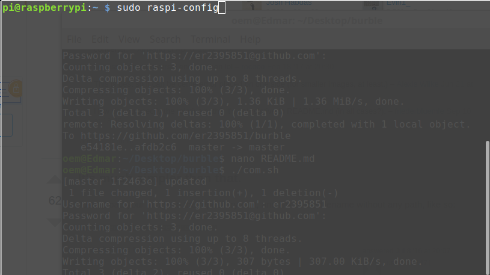

# Burble Brain Setup Steps

I installed Raspbian Stretch Lite to save on some resources.
This only gives you terminal access, so it is a bit trickier (really only to connect to wifi).

I can probably make this all a script we can run at startup that will set up the brain.

**1) Connect to wifi (If you installed with desktop, it's probably fine and you can use the GUI instead of this step)**

Add the following to this file (replacing ssid and password): 
/etc/network/interfaces

```
auto lo
 
iface lo inet loopback
iface eth0 inet dhcp
 
allow-hotplug wlan0
auto wlan0
 
 
iface wlan0 inet dhcp
        wpa-ssid "ssid"
        wpa-psk "password"
```

sudo reboot

**2) Install needed applications.**

```
sudo apt-get update
sudo apt-get install -y mpg321 mplayer git php lsof libboost-all-dev
```

Note: Also install cmake if you will edit any code.

This will take some time, grab a snack or coffee :)

**3) Enable SSH**

Enter sudo raspi-config in a terminal window.
Select Interfacing Options.
Navigate to and select SSH.
Choose Yes.
Select Ok.
Choose Finish.

**4) Add the following file to your home dir (/home/pi)**

Copy the file contents of asoundrc in this github to: 
/home/pi/.asoundrc


**5) Test your speaker jacks** 

You should be able to run the following:

Plug headphones into front out:
```
mplayer creature.wav -ao alsa:device=front_s -softvol -volume 30
```

You should hear both speakers play the sound.
```
mplayer creature.wav -ao alsa:device=front_right_s -softvol -volume 30
```
You should hear the right speaker play.

Plug into rear out and run: 
```
mplayer creature.wav -ao alsa:device=back_s -softvol -volume 30
```
You should hear both play the sound.

And finally, plug into Cen/Bassout and play: 
```
mplayer creature.wav -ao alsa:device=bass_s -softvol -volume 30
```
You should hear a sound in the left speaker.


**6) Download our source code.**

git clone https://github.com/JamesA27/story-creator.git

cd story-creator

**7) Get IP Address. ** 

Run ifconfig to get your Raspberry Pi's IP.

It should start with 192.168.  

8) Run ./start_server.sh

9) Visit [RASP_IP]:8080 in a web browser that is on the same LAN to view the story creator.

10) Create sound and lighting queues following the UI!


